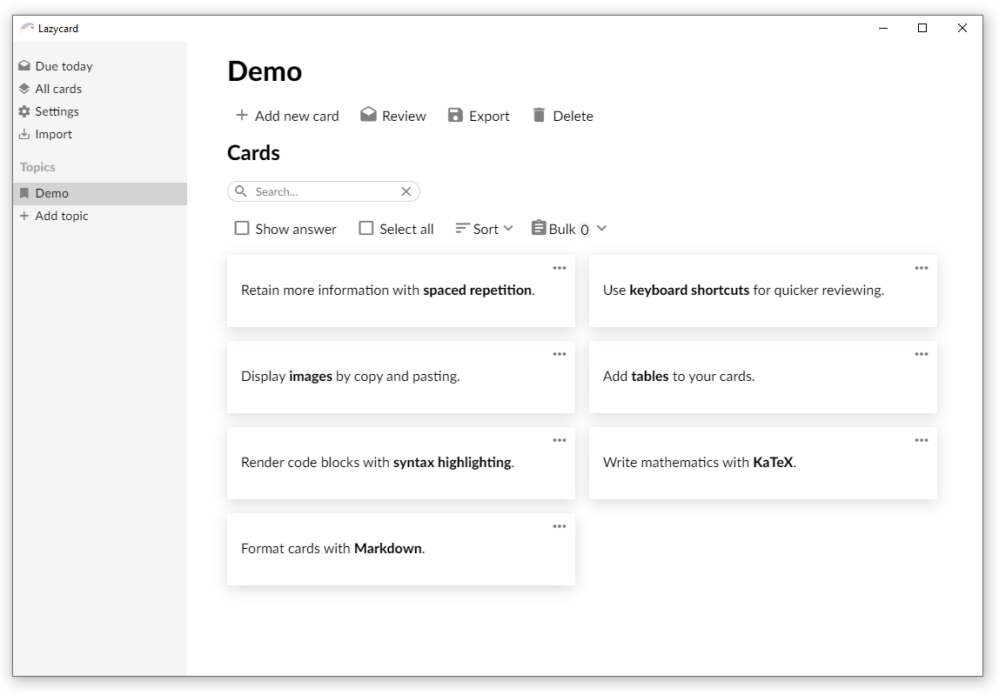

# :black_nib: Lazycard

[](https://dev.azure.com/LazyCard/LazyCard/_build/latest?definitionId=1&branchName=master)

Lazycard is a simple flashcard application utilizing spaced repetition and cards are formatted with Markdown.



## :pushpin: Features

* Write cards with Markdown
* Import and export topics (JSON)
* Simple database (JSON)

## :bookmark: Install

Head over to the [releases](https://github.com/hikikones/Lazycard/releases) page.


## :scroll: Setup

Install [Node.js](https://nodejs.org/en/). Open up a terminal and clone the project with [Git](https://git-scm.com/), `cd` into the project root folder and install all dependencies:


```
git clone https://github.com/hikikones/Lazycard.git new-folder
cd new-folder
npm install
```

## :wrench: Usage

The following commands are used for development and building:

| Node.js command | Description |
|-----------------|-------------|
| `npm start` | Builds the project in development mode and launches `Electron`. |
| `npm run pack` | Generates a portable application in the `dist` folder. |
| `npm run dist` | Generates a distributable application in the `dist` folder. |