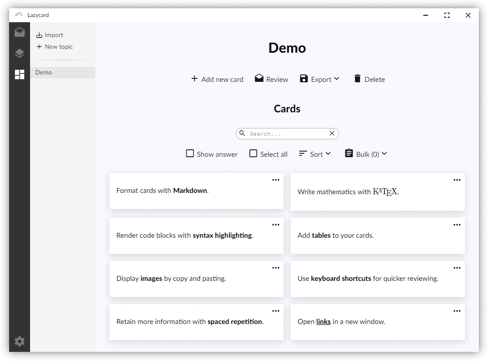

# :black_nib: Lazycard

Lazycard is a simple flashcard application utilizing [spaced repetition](https://en.wikipedia.org/wiki/Spaced_repetition) and cards are formatted with Markdown.

<p align="center">
    
</p>


## :pushpin: Features

* Write cards with Markdown
* Import and export topics (JSON)
* Export to [HTML](https://hikikones.github.io/Lazycard/) for easy sharing
* Simple database (JSON)

## :bookmark: Install

Head over to the [releases](https://github.com/hikikones/Lazycard/releases) page.


## :scroll: Setup

Install [Node.js](https://nodejs.org/en/). Open up a terminal and clone the project with [Git](https://git-scm.com/), `cd` into the project root folder and install all dependencies:

```
git clone https://github.com/hikikones/Lazycard.git
cd Lazycard
npm install
```

## :wrench: Usage

The following commands are used for development and building:

| Node.js command | Description |
|-----------------|-------------|
| `npm start` | Builds the project in development mode and launches `Electron`. |
| `npm run package` | Generates a portable application in the `dist` folder. |
| `npm run publish` | Generates a distributable application in the `dist` folder. |


## :bulb: Publishing

This repository uses [Github Actions](https://github.com/features/actions) for the build pipeline in order to create a distributable installation file for Windows, macOS and Ubuntu. The configuration file is found in `.github/workflows/build.yml`. The build is triggered whenever a [semantic](https://semver.org/) release tag of the form `v*.*.*` is created. The version also needs to be reflected in the `package.json` file. That is, say you have pushed the latest commit to the `master` branch that completes version `v1.0.0` of your application, and the version is reflected in `package.json`, then the following two commands will trigger the build:

```
git tag v1.0.0
git push --tags
```

The build workflow from `.github/workflows/build.yml` will then initiate, creating a release in draft mode on the repository, building the application on each OS and finally uploading each resulting installation file to the newly created release. You can then review the release before deciding to publish it.