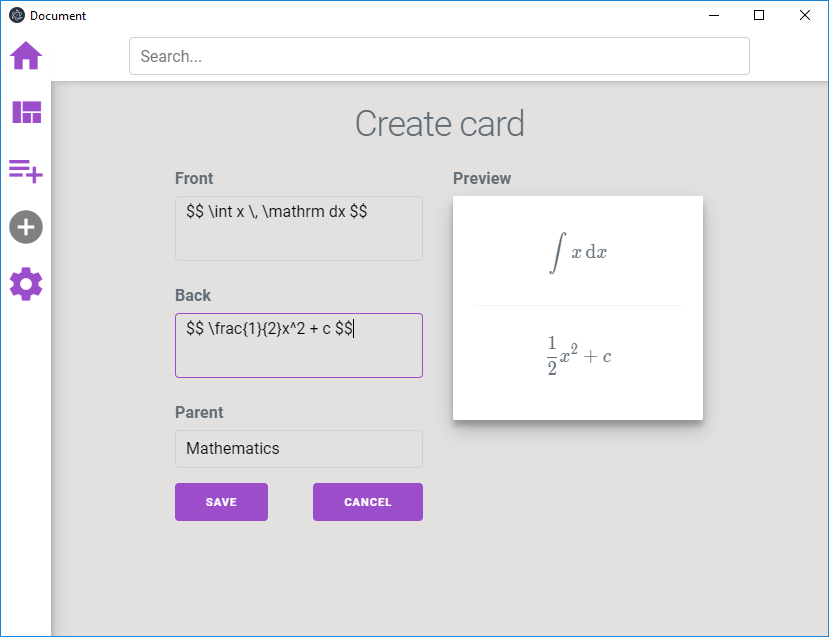
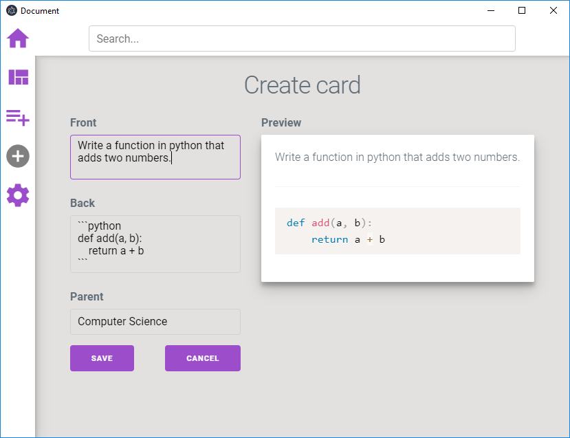
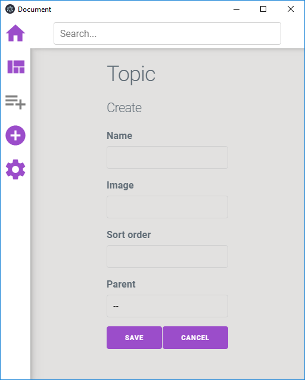
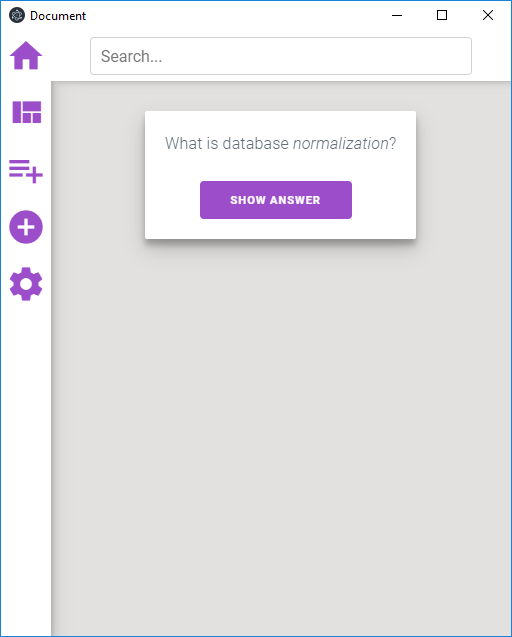
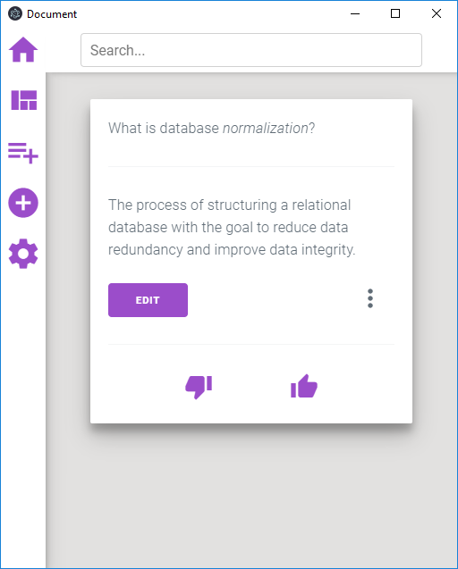

# Lazycard

Lazycard is a prototype for a spaced repetition flashcard application. It was mainly made because I don't like Anki, and want to try using flashcards forwards when learning new stuff. It was also a great learning experience for getting a little more familiar with the JavaScript ecosystem (Webpack and React) and Electron.

## Features

- **Topic creation**  
  Create a topic with a name, optional image banner and _sort order_ (chapter numbering for example).
- **Card creation**  
  Create cards using markdown. Supports [code snippets](https://github.com/adam-p/markdown-here/wiki/Markdown-Cheatsheet#code) and math typesetting with [katex](https://katex.org/). _Note: a topic must be present before you can create a card._
- **Simple review system**  
  Only two options are given when reviewing; either wrong or correct. For each correct answer, the days until next review are doubled. If wrong, back to zero. Keyboard shortcuts are supported; `Space` for showing answer, `DownArrow` for thumbs down (incorrect answer) and `UpArrow` for thumbs up (correct answer).
- **Backup sync**  
  Set a path directory in the Settings panel for where you want to take backup (a Dropbox folder for example). Then a backup will be created/updated every time you close the application and synced when you open it. This is practical if you are using two computers. Just remember to only use the application on one computer at a time, and wait for Dropbox to finish syncing before opening Lazycard on another computer. Also, if you want to import a backup, just copy it to the application data directory for Lazycard (see below) and overwrite all files.

## Path location for images

Images for use in the application must be stored in the application data directory, which be default points to:

- `%APPDATA%` on Windows
- `$XDG_CONFIG_HOME` or `~/.config` on Linux
- `~/Library/Application Support` on macOS

From there, navigate to `lazycard/user/images`. Images must be stored here, and can then be used in the application by simply writing the full filename of the image whenever it is needed.

## Demo Images

### Topics and cards overview


### Card creation




### Topic creation



### Card review




## Setup

Install [Node.js](https://nodejs.org/en/). If your project uses native Node modules, it's important to have the proper build tools in order to compile them. If your project doesn't need native Node modules, ignore the following instructions on compiling.

### Compiling on Windows

On Windows you need the [windows-build-tools](https://github.com/felixrieseberg/windows-build-tools). Open `PowerShell` with admin rights and execute the following command:

```
npm install --global --vs2015 windows-build-tools
```

**Note:** this will install the Visual Studio 2015 build tools, which is needed in this project.

Installing the windows build tools will take some time, so wait patiently.

### Compiling on macOS and Linux

Only [Node.js](https://nodejs.org/en/) is required, I think.

## Installation

Open a terminal and clone the project with [Git](https://git-scm.com/), and then `cd` into the project root folder where the `package.json` file is to install all dependencies:

```
https://github.com/hikikones/Lazycard.git my-project
cd my-project
npm install
```

If you have a native module and get an error about some Python function not working during dependency installation, you may have to install [Python **2**](https://www.python.org/downloads/) with the `PATH` environment variable on Windows. Then remove the `node_modules` folder and install all dependencies again with `npm install`.

## Usage

The following commands are used for development and building:

| Command               | Description                                                                                                                                |
| --------------------- | ------------------------------------------------------------------------------------------------------------------------------------------ |
| `npm run dev`         | Builds the project in development mode and opens it in Electron.                                                                           |
| `npm run pack`        | Generates a package directory in `dist` folder without packaging it so you can open the program without installing it. Useful for testing. |
| `npm run dist`        | Generates a package in distributable format in the `dist` folder.                                                                          |
| `npm run postinstall` | Compiles native dependencies. This is automatically run when you install all dependencies with `npm install`.                              |
